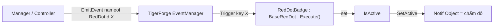

# RedDot Module

`Ezg.Core.RedDot`

Hệ thống **chấm đỏ / badge indicator** event-driven cho UI: tự bật/tắt một GameObject (chấm đỏ) khi có hành động cần chú ý (quà chưa nhận, nội dung mới mở khóa, deal trong shop...). Loose-coupling qua **TigerForge EventManager** — UI chỉ lắng nghe theo một "event key", logic nghiệp vụ chỉ phát event, hai bên không biết nhau.

Module được tách **2 tầng** để phần lõi tái dùng được như package:

- **Package** (`Ezg.Core.RedDot`) — `BaseRedDot`: lớp base generic, **không** biết danh sách id của game, **không** phụ thuộc Odin, **không** chứa project data.
- **Project** (`Ezg.Feature.RedDot`) — `RedDotId` + `RedDotBadge`: phần riêng của từng game, **sinh ra ngoài package** bằng menu Project setup.

> 👉 Bạn **luôn kế thừa `RedDotBadge`** cho indicator mới, **không** kế thừa `BaseRedDot` trực tiếp (nó là `abstract`).

---

## Cấu trúc thư mục

```
RedDot/                                 # PACKAGE — namespace Ezg.Core.RedDot
├── BaseRedDot.cs                       # Abstract MonoBehaviour: toggle chấm đỏ + subscribe event
├── README.md
└── Editor/
    ├── Ezg.Core.RedDot.Editor.asmdef
    └── RedDotProjectSetup.cs           # Menu Create ▸ Ezg ▸ RedDot ▸ Project setup

Features/_Shared/RedDot/                # PROJECT — namespace Ezg.Feature.RedDot (sinh ngoài package)
├── RedDotId.cs                         # enum id, riêng từng game
└── RedDotBadge.cs                      # base phía project: : BaseRedDot, nối RedDotId -> EventKey
```

> Phần package nằm trong namespace `Ezg.Core.RedDot`. Phần riêng của game (`RedDotId`, `RedDotBadge`) dùng `Ezg.Feature.RedDot` và sống ở `Assets/_Project/Features/_Shared/RedDot/` — xem mục 1.

---

## Kiến trúc 2 tầng (vì sao tách)

`BaseRedDot` chỉ cần **một string event key** để biết lắng nghe sự kiện nào — nó không cần biết tập id cụ thể của game. Vì vậy việc cung cấp key được đẩy xuống tầng project:



| Tầng | Class | Vai trò |
|------|-------|---------|
| Package | `BaseRedDot` (abstract) | Giữ `_notifObject`, `IsActive`, vòng đời subscribe/unsubscribe. Lắng nghe theo `EventKey` (abstract). Không biết `RedDotId`. |
| Project | `RedDotBadge` (abstract) | `: BaseRedDot`. Serialize một `RedDotId _notifId` và trả `EventKey => _notifId.ToString()`. |
| Project | `RedDotId` (enum) | Danh sách id chấm đỏ riêng của game. |
| Project | `XxxNotif` | `: RedDotBadge`. Override `Execute()` để tính trạng thái hiển thị. |

**Token (event key) = tên member enum.** Bên phát gửi `nameof(RedDotId.ShopNotif)` = `"ShopNotif"`; bên lắng nghe dùng `_notifId.ToString()` = `"ShopNotif"`. Hai chuỗi luôn khớp — đổi namespace/đổi tên type không ảnh hưởng token.

---

## 1. Project setup (làm trước ở dự án mới)

**Create ▸ Ezg ▸ RedDot ▸ Project setup**

Tool sinh 2 file vào `Assets/_Project/Features/_Shared/RedDot/`:

- `RedDotId.cs` — enum starter (chỉ `None` + TODO), bạn tự thêm id của game.
- `RedDotBadge.cs` — base phía project (template đầy đủ, không cần sửa).

```csharp
// RedDotBadge.cs (sinh tự động)
using Ezg.Core.RedDot;
using UnityEngine;

namespace Ezg.Feature.RedDot
{
    public abstract class RedDotBadge : BaseRedDot
    {
        [SerializeField] private RedDotId _notifId;
        protected override string EventKey => _notifId.ToString();
    }
}
```

### Vì sao cần tool này (giữ reference khi tái dùng)

Tool ghi file `.cs` **kèm `.meta` (GUID cố định)** ra đĩa **trước** `AssetDatabase.Refresh()`, nên Unity import script theo **đúng GUID cũ** thay vì sinh GUID mới. Nhờ đó prefab/asset UI mang sang dự án mới **không mất reference** tới script.

| File | GUID (pin cố định) |
|------|--------------------|
| `RedDotId.cs` | `1dd61ccb117b52148a296a8ae44b3408` |
| `RedDotBadge.cs` | `c8086291de801c699f737a7d3bd34b69` |

> ⚠️ Nếu file đã tồn tại, tool hỏi xác nhận **Overwrite**. Trong **dự án hiện tại** hai file đã có sẵn (RedDotId có đủ id của game) — **đừng** bấm Overwrite ở đây, vì sẽ reset `RedDotId` về starter. Menu này dành cho **dự án mới**.

---

## 2. Định nghĩa id — `RedDotId`

Thêm member vào `RedDotId.cs` (mỗi indicator một id):

```csharp
namespace Ezg.Feature.RedDot
{
    public enum RedDotId
    {
        None,
        ShopNotif,
        DailyRewardNotif,
        PiggyBankNotif,
        // ...
    }
}
```

> Quy ước đặt tên: `[Feature]Notif`. Tên member chính là token event — đặt nhất quán giữa nơi phát và nơi nghe.

---

## 3. Tạo badge — kế thừa `RedDotBadge`

Tạo `[Feature]Notif.cs` trong thư mục Controller của feature:

```csharp
using Ezg.Feature.RedDot;

internal class ShopNotif : RedDotBadge
{
    public override void Execute()
    {
        base.Execute();
        IsActive = ShopService.CanClaimDailyDeal();   // true -> hiện chấm đỏ
    }
}
```

- Chỉ cần override `Execute()` và gán `IsActive`. `Execute()` được gọi tự động khi: `OnEnable`, và mỗi lần event tương ứng được phát.
- Class concrete (không `abstract`) mới gắn được lên GameObject.

---

## 4. Gắn trong Unity

1. Tạo/chọn GameObject chấm đỏ (icon đỏ con).
2. Add component `ShopNotif` lên nút (hoặc parent chứa chấm đỏ).
3. Trong Inspector:
   - **Notif Id** → chọn `RedDotId` tương ứng (vd `ShopNotif`).
   - **Notif Object** → kéo GameObject chấm đỏ vào.

---

## 5. Phát event từ logic nghiệp vụ

Gọi mỗi khi dữ liệu đổi (nhận quà, mua hàng, hết thời gian...):

```csharp
using Ezg.Feature.RedDot;
using TigerForge;

EventManager.EmitEvent(nameof(RedDotId.ShopNotif));
```

Một feature có thể phát cùng một event từ nhiều nơi — mọi badge đang nghe id đó sẽ `Execute()` lại.

---

## API Reference

### `BaseRedDot` (package, abstract)

| Thành viên | Mô tả |
|------------|-------|
| `protected abstract string EventKey { get; }` | Key lắng nghe. Tầng project hiện thực (từ enum). |
| `public virtual void Execute()` | Override để tính & gán `IsActive`. |
| `public bool IsActive { get; set; }` | Set → tự `SetActive` cho `_notifObject`. |
| `[SerializeField] private GameObject _notifObject` | Chấm đỏ được bật/tắt (Inspector: **Notif Object**). |
| `protected virtual void Awake()` | `EventManager.StartListening(EventKey, Execute)`. |
| `protected virtual void OnEnable()` | Gọi `Execute()`. |
| `public virtual void Start()` | Đồng bộ hiển thị `_notifObject`. |
| `private void OnDestroy()` | `EventManager.StopListening(EventKey, Execute)`. |

### `RedDotBadge` (project, abstract)

| Thành viên | Mô tả |
|------------|-------|
| `[SerializeField] private RedDotId _notifId` | Chọn id trong Inspector (**Notif Id**). |
| `protected override string EventKey => _notifId.ToString()` | Cầu nối enum → key cho package. |

---

## Vòng đời

| Sự kiện | Hành vi |
|---------|---------|
| `Awake()` | Subscribe EventManager theo `EventKey` (= `_notifId.ToString()`). |
| `OnEnable()` | Gọi `Execute()` để refresh trạng thái. |
| `Start()` | Đồng bộ hiển thị `_notifObject`. |
| Nhận event | `Execute()` → cập nhật `IsActive` → bật/tắt `_notifObject`. |
| `OnDestroy()` | Unsubscribe EventManager. |

---

## Phụ thuộc

- **TigerForge EventManager** — hệ event loose-coupling (subscribe/emit theo string key).
- **UnityEngine** — `MonoBehaviour`, `GameObject`, `SerializeField`.
- **KHÔNG dùng Odin** — cố ý, để package nhẹ dependency. Mọi attribute Inspector chỉ dùng `[SerializeField]` thuần.

---

## Trạng thái đóng gói

- Runtime: `BaseRedDot.cs` — namespace `Ezg.Core.RedDot`. (Hiện tạm nằm trong assembly `Ezg.Core`; khi đóng package sẽ tách thành asmdef riêng `Ezg.Core.RedDot`.)
- Editor: assembly `Ezg.Core.RedDot.Editor` (Editor-only) — chứa menu Project setup, **đi theo package** để bootstrap được phần project ở dự án mới.

---

## Giới hạn / Lưu ý

- `BaseRedDot` và `RedDotBadge` đều `abstract` — không gắn trực tiếp lên GameObject; chỉ gắn class concrete `XxxNotif`.
- Đổi base/namespace **không** làm mất data serialize: Unity lưu theo *script GUID của class concrete* + *tên field* (`_notifId`, `_notifObject`) — giữ nguyên tên & kiểu thì giá trị trên prefab cũ còn nguyên.
- `RedDotId` là enum value-type: prefab lưu `_notifId` dưới dạng **int**. Khi mang prefab sang dự án mới, giữ **đúng thứ tự member** để int map về đúng id.

---

## Checklist tích hợp nhanh

1. [ ] (Dự án mới) **Create ▸ Ezg ▸ RedDot ▸ Project setup** để sinh `RedDotId.cs` + `RedDotBadge.cs`.
2. [ ] Thêm các id vào `RedDotId` (đặt tên `[Feature]Notif`).
3. [ ] Tạo `XxxNotif : RedDotBadge`, override `Execute()` gán `IsActive`.
4. [ ] Gắn component lên nút, set **Notif Id** + **Notif Object** trong Inspector.
5. [ ] Phát `EventManager.EmitEvent(nameof(RedDotId.Xxx))` mỗi khi trạng thái đổi.
