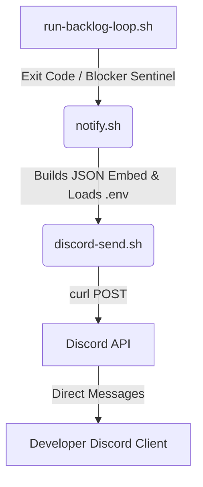

# Hướng Dẫn Triển Khai Discord Notification Cho Backlog Automation Loop

Tài liệu này hướng dẫn cách cấu hình và tích hợp hệ thống thông báo tự động qua Discord (Direct Messages) khi vòng lặp thực thi task của Agent (`run-backlog-loop`) dừng lại hoặc bị chặn (blocked) do các điều kiện cần can thiệp thủ công (Manual Intervention).

---

## 1. Kiến Trúc Hệ Thống

Hệ thống thông báo bao gồm các thành phần sau:
* **`.env`**: Lưu trữ cấu hình nhạy cảm (Token, ID người nhận) và được ẩn khỏi Git.
* **`discord-send.sh`**: Script lõi thực hiện việc giao tiếp với Discord API (tạo kênh DM với từng user và gửi tin nhắn/embed).
* **`notify.sh`**: Script điều phối, phân loại loại sự kiện (Event), tự động định dạng màu sắc, biểu tượng, xây dựng JSON Embed và gọi `discord-send.sh`.
* **`run-backlog-loop.sh`**: Script vòng lặp chính, bắt sự kiện dừng/lỗi và gọi `notify.sh` để bắn tin nhắn cho developer.



---

## 2. Các Bước Triển Khai & Cấu Chỉ

### Bước 1: Tạo Discord Bot & Lấy Token
1. Truy cập [Discord Developer Portal](https://discord.com/developers/applications).
2. Nhấn **New Application** và đặt tên cho Bot (ví dụ: `[Project Name] Backlog Agent`).
3. Đi tới mục **Bot** ở menu bên trái, nhấn **Add Bot**.
4. Tại phần Token, nhấn **Reset Token** và copy Token này (đây là `DISCORD_BOT_TOKEN`).
5. Cuộn xuống phần **Privileged Gateway Intents**, bật **Presence Intent**, **Server Members Intent**, và **Message Content Intent** (nếu cần tương tác 2 chiều sau này). Nhấn **Save Changes**.

### Bước 2: Lấy Discord User ID của Developer
1. Mở ứng dụng Discord, vào **User Settings** -> **Advanced**.
2. Bật tùy chọn **Developer Mode**.
3. Ra ngoài danh sách chat hoặc thành viên, click chuột phải vào avatar của chính bạn (hoặc developer cần nhận tin nhắn) và chọn **Copy User ID** (đây là chuỗi số dài, ví dụ: `924732755957383188`).

### Bước 3: Cấu Hình File `.env` tại thư mục gốc dự án
Tạo file `.env` tại thư mục gốc của project (nằm cùng cấp với thư mục Assets) với nội dung sau:

```env
# Discord Bot Notification Settings
DISCORD_BOT_TOKEN=YOUR_DISCORD_BOT_TOKEN_HERE
DISCORD_DEVELOPERS=DEVELOPER_USER_ID_1,DEVELOPER_USER_ID_2
```
*(Nếu có nhiều developer nhận tin nhắn, phân cách các ID bằng dấu phẩy `,`)*

### Bước 4: Bảo mật với `.gitignore`
Chắc chắn rằng file `.env` không bao giờ bị push lên Git bằng cách thêm dòng sau vào file `.gitignore` của dự án:
```gitignore
# Local environment variables containing credentials
.env
```

---

## 3. Các Script Thành Phần

### A. Core Sender Script (`.agents/scripts/discord-send.sh`)
Tải/tạo file script này với quyền thực thi (`chmod +x`). Script này có nhiệm vụ:
1. Đọc file `.env` cục bộ.
2. Với mỗi User ID, gửi yêu cầu API tạo phòng chat DM (`/users/@me/channels`).
3. Gửi nội dung tin nhắn hoặc cấu trúc Rich Embed qua phòng chat đó.

### B. Notification Router (`.agents/scripts/notify.sh`)
Script này nhận các tham số để định dạng tin nhắn đẹp mắt trên Discord (sử dụng Embed màu sắc):
* `--event`: Tên sự kiện dừng vòng lặp (Ví dụ: `BACKLOG_EMPTY`, `COMPILE_BLOCKED`, `PREFLIGHT_BLOCKED`, `REVIEW_BLOCKED`, `VERIFY_BLOCKED`).
* `--task`: Tên task đang thực thi.
* `--url`: Link clickable của task spec (dạng `file:///absolute/path/to/task.md`).
* `--details`: Log lỗi chi tiết hoặc mô tả lỗi.

---

## 4. Tích hợp vào Vòng Lặp Main Runner (`run-backlog-loop.sh`)

Mở script runner vòng lặp chính của dự án và chèn code gọi thông báo tại các vị trí:

### A. Báo khi hoàn thành toàn bộ backlog (`BACKLOG_EMPTY`)
Tìm đoạn check số lượng task ở đầu vòng lặp `while`:
```bash
read -r TODO IP <<<"$(backlog_counts)"
if [ "$TODO" -eq 0 ] && [ "$IP" -eq 0 ]; then
  STOP_REASON="Backlog empty (no TODO, no IN PROGRESS)"
  # Chèn thông báo
  bash "$SCRIPT_DIR/notify.sh" \
    --event "BACKLOG_EMPTY" \
    --task "N/A" \
    --details "All backlog tasks have been processed successfully."
  break
fi
```

### B. Trích xuất thông tin task phục vụ notify
Chèn đoạn code này ngay sau phần kiểm tra backlog trống để phân giải tên task và đường dẫn file phục vụ gửi tin nhắn:
```bash
CURRENT_TASK_LINE="$(task_line_for_section "IN PROGRESS")"
[ -z "$CURRENT_TASK_LINE" ] && CURRENT_TASK_LINE="$(task_line_for_section "TODO")"

if [ -n "$CURRENT_TASK_LINE" ]; then
  TASK_TIER_NOTIF="$(printf '%s\n' "$CURRENT_TASK_LINE" | sed -nE 's/^[[:space:]]*-[[:space:]]*\[[^]]+\][[:space:]]+\[(XS|S|M|L)\].*/\1/p')"
  if [ -n "$TASK_TIER_NOTIF" ]; then
    TASK_TITLE_NOTIF="$(printf '%s\n' "$CURRENT_TASK_LINE" | sed -E 's/^[[:space:]]*-[[:space:]]*\[[^]]+\][[:space:]]+\[[^]]+\][[:space:]]+\[([^]]+)\].*/\1/')"
  else
    TASK_TITLE_NOTIF="$(printf '%s\n' "$CURRENT_TASK_LINE" | sed -E 's/^[[:space:]]*-[[:space:]]*\[[^]]+\][[:space:]]+\[([^]]+)\].*/\1/')"
  fi
  TASK_FILE_PATH_NOTIF="$(printf '%s\n' "$CURRENT_TASK_LINE" | sed -nE 's/.*\]\((backlog\/[^)]+)\).*/\1/p')"
  if [ -n "$TASK_FILE_PATH_NOTIF" ]; then
    TASK_URL_NOTIF="file://$REPO_ROOT/$TASK_FILE_PATH_NOTIF"
  else
    TASK_URL_NOTIF=""
  fi
else
  TASK_TITLE_NOTIF="Unknown Task"
  TASK_URL_NOTIF=""
fi
```

### C. Báo khi gặp lỗi crash/compile thất bại (`exit_code -ne 0`)
```bash
if [ "$exit_code" -ne 0 ]; then
  STOP_REASON="claude exited non-zero ($exit_code) on iteration $i (see $log_file)"
  bash "$SCRIPT_DIR/notify.sh" \
    --event "COMPILE_BLOCKED" \
    --task "$TASK_TITLE_NOTIF" \
    --url "$TASK_URL_NOTIF" \
    --details "$STOP_REASON"
  break
fi
```

### D. Báo khi gặp các blocker sentinel từ AI reviewer/preflight
```bash
if is_blocked "$log_file"; then
  STOP_REASON="Blocker sentinel detected on iteration $i (see $log_file)"
  
  block_event="VERIFY_BLOCKED"
  block_details="Manual intervention required."
  
  if grep -q "COMPILE_BLOCKED" "$log_file"; then
    block_event="COMPILE_BLOCKED"
    block_details=$(grep -o "COMPILE_BLOCKED.*" "$log_file" | head -n 1)
  elif grep -q "PREFLIGHT_BLOCKED" "$log_file"; then
    block_event="PREFLIGHT_BLOCKED"
    block_details=$(grep -o "PREFLIGHT_BLOCKED.*" "$log_file" | head -n 1)
  elif grep -q "REVIEW_BLOCKED" "$log_file"; then
    block_event="REVIEW_BLOCKED"
    block_details=$(grep -o "REVIEW_BLOCKED.*" "$log_file" | head -n 1)
  elif grep -q "VERIFY_BLOCKED" "$log_file"; then
    block_event="VERIFY_BLOCKED"
    block_details=$(grep -o "VERIFY_BLOCKED.*" "$log_file" | head -n 1)
  else
    block_details=$(grep -i "manual intervention.*" "$log_file" | head -n 1)
    [ -z "$block_details" ] && block_details="Automation paused. Manual intervention required."
  fi

  bash "$SCRIPT_DIR/notify.sh" \
    --event "$block_event" \
    --task "$TASK_TITLE_NOTIF" \
    --url "$TASK_URL_NOTIF" \
    --details "$block_details"
  break
fi
```

---

## 5. Kiểm Thử Hệ Thống

Để đảm bảo việc cấu hình `.env` và phân quyền chạy script chính xác, chạy thử lệnh trực tiếp trên Terminal:

```bash
# Test gửi thông báo khi trống backlog (Success - Màu xanh lá)
bash .agents/scripts/notify.sh \
  --event "BACKLOG_EMPTY" \
  --task "N/A" \
  --details "Không còn task nào trong backlog."

# Test gửi thông báo khi lỗi compile (Error - Màu đỏ)
bash .agents/scripts/notify.sh \
  --event "COMPILE_BLOCKED" \
  --task "Sửa Lỗi Logic Game" \
  --url "file:///path/to/your-project/backlog/todo/001-fix-logic.md" \
  --details "error CS1002: ; expected in Assets/_Project/GameplayManager.cs:42"
```
