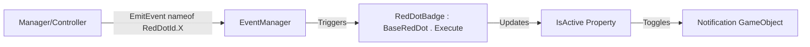

# RedDot Module Reference

## When to Use This Skill
- **Notification Icons**: Display red dots or badges on UI buttons when action is needed.
- **Event-Driven Updates**: Auto-update notification state when data changes.
- **Feature Indicators**: Show availability of rewards, unlocked content, or required actions.

## Overview
The RedDot module is split into two layers so the reusable part can ship as a package:

- **Package** (`Ezg.Core.RedDot`) — `BaseRedDot`, an abstract MonoBehaviour holding the
  red-dot toggle + event subscription logic. It is project-agnostic: it listens on an
  abstract `EventKey` string and knows nothing about the game's id list.
- **Project** (`Ezg.Feature.RedDot`) — `RedDotId` (the game-specific enum) and `RedDotBadge`,
  a thin base that serializes a `RedDotId` and feeds `EventKey => _notifId.ToString()` to the package.

**You always inherit `RedDotBadge`** for new indicators, never `BaseRedDot` directly.

**Locations**:
- Package: `Packages/com.ezg.reddot/Runtime/BaseRedDot.cs`
- Project: `Assets\_Project\Features\_Shared\RedDot\` (`RedDotId.cs`, `RedDotBadge.cs`)

## Architecture



The event token is the **enum member name**: the emitter sends `nameof(RedDotId.X)` and the
badge listens on `_notifId.ToString()` — both resolve to the same string `"X"`.

## Core Components

### RedDotId Enum (project)
Define notification types in `Assets\_Project\Features\_Shared\RedDot\RedDotId.cs`:
```csharp
namespace Ezg.Feature.RedDot
{
    public enum RedDotId
    {
        None,
        QuestNotif,
        BattlePassNotif,
        DailyRewardNotif,
        // Add new types here...
    }
}
```

### RedDotBadge (project base you inherit)
- **_notifId**: Select the `RedDotId` in Inspector — this picks the event to listen on.
- **_notifObject**: GameObject to show/hide (the red dot) — declared on `BaseRedDot`.
- **IsActive**: Controls visibility of `_notifObject`.
- **Execute()**: Override to define notification logic.

## How to Implement

### Step 1: Add RedDotId
Add a new enum value in `RedDotId.cs`:
```csharp
public enum RedDotId
{
    // existing...
    MyFeatureNotif,
}
```

### Step 2: Create Notification Class
Create `[Feature]Notif.cs` in the feature's Controller folder (inherit `RedDotBadge`):
```csharp
using Ezg.Feature.RedDot;

internal class MyFeatureNotif : RedDotBadge
{
    public override void Execute()
    {
        base.Execute();
        IsActive = MyFeatureManager.HasNotification();
    }
}
```

### Step 3: Setup in Unity
1. Create/select the notification indicator GameObject (red dot).
2. Add `MyFeatureNotif` component to parent button.
3. In Inspector:
   - Set **Notif Id** to `MyFeatureNotif`.
   - Drag red dot to **Notif Object** field.

### Step 4: Emit Events from Manager
Trigger a notification refresh when state changes:
```csharp
using Ezg.Feature.RedDot;
using TigerForge;

public class MyFeatureManager
{
    public static bool HasNotification() => /* your logic */;

    public static void OnDataChanged()
    {
        // ... update data ...

        // Trigger notification refresh
        EventManager.EmitEvent(nameof(RedDotId.MyFeatureNotif));
    }
}
```

## Real Examples

### Simple Notification (PiggyBank)
```csharp
internal class PiggyBankNotif : RedDotBadge
{
    public override void Execute()
    {
        base.Execute();
        IsActive = PiggyBankManager.HaveNotif();
    }
}
```

### Conditional Notification (LuckySpin)
```csharp
internal class LuckySpinNotif : RedDotBadge
{
    public bool IsTotal;
    public bool IsLuckySpin;
    public long ValueCheck;

    public override void Execute()
    {
        base.Execute();
        IsActive = IsTotal 
            ? PlayerResource.IsEnough(EnumBase.MoneyTypes.LuckySpinCoin, ValueCheck) ||
              LuckySpinManager.HaveAnyNotif
            : IsLuckySpin 
                ? PlayerResource.IsEnough(EnumBase.MoneyTypes.LuckySpinCoin, ValueCheck)
                : LuckySpinManager.HaveAnyNotif;
    }
}
```

## Best Practices

1. **Inherit `RedDotBadge`**, not `BaseRedDot` (the package base is abstract and project-agnostic).
2. **Naming Convention**: Use `[Feature]Notif` for class names.
3. **Static Check Method**: Create `HaveNotif()` or `HasNotification()` in Manager.
4. **Emit on State Change**: Call `EventManager.EmitEvent(nameof(RedDotId.X))` whenever relevant data changes.
5. **Multiple Triggers**: One feature can emit its notification event from multiple places.

## Lifecycle

| Event | Behavior |
|-------|----------|
| `Awake()` | Subscribes to EventManager with `EventKey` (= `_notifId.ToString()`) |
| `OnEnable()` | Calls `Execute()` to refresh state |
| `Start()` | Updates `_notifObject` visibility |
| Event Received | Calls `Execute()` → updates `IsActive` → toggles `_notifObject` |
| `OnDestroy()` | Unsubscribes from EventManager |
