# Thư viện VFX dùng chung

Phiên bản 0.2.2 · 2026-10-01 · 51 hiệu ứng world (trong thế giới game, 2D và 3D) và 16 hiệu ứng trên UI canvas, đã
chuẩn hoá theo `GameVFX_QuyChuan.md`. Nguồn: hiệu ứng đã ship của các game mobile của team (khảo sát sáu game: ba 2D, ba 3D;
chọn từ bốn game, vì một game 3D có mọi hiệu ứng đã ship trùng với game 3D làm sau nó, một game 2D là bản gốc của game reskin
đã chọn), gồm hiệu ứng team tự làm (36) và hiệu ứng của pack Epic Toon FX mà game nào của team cũng mang (31). Chỉ
lấy hiệu ứng dùng chung được: không gắn với nhân vật, quái, màn, item riêng của một game, và tự chạy được khi không có script của
game. Mọi file chép sang với GUID mới: import thư viện vào game nào cũng không đè asset sẵn có của game đó (kể cả bản Epic Toon
FX của game). File lấy từ Epic Toon FX (hiệu ứng `pack`, và texture, mesh của pack mà cả hiệu ứng team cũng dùng) theo giấy
phép của studio: chỉ dùng trong game và repo nội bộ của studio, không đưa ra ngoài.

Mỗi hiệu ứng trong thư viện:

- Root có component `FXEffect` và một `ParticleSystem` điều khiển (Stop Action = Callback); phát khi bật object, tự tắt object khi
  hạt cuối cùng tắt (quy chuẩn 7.1, 6.8).
- Hiệu ứng world chạy giờ game, hiệu ứng UI chạy giờ thật (3.4). Culling Automatic ở world; UI để Always Simulate vì UIParticle
  tắt renderer của system. UIParticle tắt Raycast Target: hạt không chặn chạm vào nút nằm dưới (7.5.6).
- Không script của game, không collider, không Light, không AudioSource, không object tắt, không system chết (không phát, không
  renderer, renderer tắt ở world, mesh không tải được), không system vẽ ô trơn (không sprite, không texture), không tham chiếu
  tới file không tồn tại (6.5.5).
- `Max Particles` đặt theo số hạt cần thật × 1,2; system chỉ burst ở giây 0 được rút Duration còn 0,1 s để object về pool sớm.
- Material dùng một shader chung `EZG/VFX/Particle`; material trùng nhau được gộp.
- Không frame-by-frame (quy chuẩn 4.7): 16 hiệu ứng từng có sheet chạy khung đã đổi: giữ một khung đầy hình nhất, cho
  hạt tan bằng Erosion của shader chung (theo noise; hướng tâm cho đĩa và vòng). Sheet còn lại chỉ để mỗi hạt lấy ngẫu nhiên
  một hình tĩnh.
- Texture: mipmap bật cho texture mà hiệu ứng 3D dùng, tắt cho texture chỉ hiệu ứng 2D và UI dùng (4.5); override Android / iOS
  ASTC 6 × 6 (world) hoặc 4 × 4 (UI), cạnh tối đa theo trần của cấp (6.2, sheet flipbook được gấp đôi). Nguồn lớn hơn 2048 đã đổi thành PNG ≤ 2048; mesh trong `.blend` đã tách ra `.asset` (không cần Blender).

---

## 1. Có gì

| Đường dẫn trong module | Là gì |
|---|---|
| `Library/World/<Nhóm>/FX_<Nhóm>_<Tên>.prefab` | hiệu ứng world |
| `Library/UI/FX_UI_<Tên>.prefab` | hiệu ứng trên canvas (UIParticle) |
| `Library/Shared/Shaders/FX_SH_Particle.shader` | shader `EZG/VFX/Particle`: unlit, texture × màu hạt × tint × cường độ; bốn kiểu trộn Alpha, Additive, Premultiply, Multiply; chạy cả Built-in lẫn URP (không LightMode tag, như nhóm `Mobile/Particles`); có stencil cho Mask trên canvas. Bật riêng từng cái: Erosion, UV Scroll, Mask, Ramp (quy chuẩn 4.7, 6.6.8) |
| `Library/Shared/Materials/FX_MT_<Tên>_<Add \| AB \| PM \| Mul>.mat` | material dùng chung |
| `Library/Shared/Textures/FX_TX_…`, `Library/Shared/Meshes/FX_SM_…` | texture, mesh; `FX_TX_Noise_Erosion` (noise lặp được) và `FX_TX_Erosion_Radial` (hướng tâm) dùng chung cho Erosion |
| `Runtime/FXEffect.cs` | gốc của hiệu ứng: `Play`, `Stop`, `Finished`, `LowQuality`, `DefaultSortingLayer` |
| `Docs/Previews~/` | ảnh xem trước (Unity bỏ qua folder có `~`) |

Thư viện nặng khoảng 51 MB trên đĩa (texture nguồn); trong bản build chỉ có hiệu ứng game thật sự dùng.

Gói `GameVFX` trên Feature Hub (tab Unity Packages) chỉ có phần lõi: `Runtime/FXEffect.cs`, shader chung và tài liệu.
Prefab, material, texture, mesh của thư viện chỉ có trong repo phát triển module, vì có file của pack mua (đầu tài liệu). Ảnh
xem trước không vào gói Unity (Unity bỏ qua folder có `~`), nhưng đi kèm skill `game-vfx` (tab AI Feature) cùng bản chép tài
liệu này.

## 2. Dùng

**[VFX] [DEV]**

1. Kéo prefab vào scene, hoặc spawn bằng pool của game. Hiệu ứng tự phát khi object bật (Play On Awake) và tự tắt object khi xong
   (`FXEffect.whenFinished = Disable`): pool bật lại object là phát lại. Không pool thì đổi sang `Destroy`.
2. Code, với pool của Unity:

   ```csharp
   ObjectPool<FXEffect> pool = null;
   pool = new ObjectPool<FXEffect>(
       createFunc: () => { var fx = Instantiate(prefab); fx.Finished += f => pool.Release(f); return fx; }, // nghe một lần, lúc tạo
       actionOnRelease: fx => fx.gameObject.SetActive(false));

   var fx = pool.Get();
   fx.transform.SetPositionAndRotation(point, rotation);
   fx.Play();                // bật object, hoặc phát lại từ đầu nếu đang bật
   fx.Stop();                // hiệu ứng lặp: ngừng phát, hạt đang sống chạy nốt rồi báo xong (về pool)
   fx.Stop(true);            // xoá ngay
   fx.autoStopAfter = 3f;    // hiệu ứng lặp tự dừng sau 3 s
   ```

   Game đã có đường spawn riêng (quy chuẩn 7.8.4): giữ đường đó, chỉ thêm việc nghe `Finished` thay cho hẹn giờ tắt.
3. Lúc khởi động game:
   - Máy tier Thấp: `FXEffect.LowQuality = true` (tắt con có tên kết thúc bằng `_Sec`, quy chuẩn 6.4). Bản 0.2.2 chưa đánh dấu `_Sec`
     cho hiệu ứng nào (mục 4).
   - Game 2D: `FXEffect.DefaultSortingLayer = "FX"` (layer VFX của game, quy chuẩn 7.3). Prefab để layer `Default`.
4. Hiệu ứng có material Erosion (`FX_MT_…_Ero_…`): alpha của hạt là ngưỡng tan, không phải độ mờ. Muốn mờ cả hiệu ứng thì giảm
   alpha của Tint trên bản chép của material, không giảm alpha của hạt.
5. Cỡ: scale root (Scaling Mode Hierarchy). Màu: tạo material mới từ material của thư viện rồi đổi Tint; không sửa material gốc
   (nhiều hiệu ứng dùng chung).
6. Hiệu ứng UI: đặt prefab dưới Canvas. Cần package `com.coffee.ui-particle` (UIParticle 4.13.2,
   `https://github.com/mob-sakai/ParticleEffectForUGUI.git#4.13.2`, đã khai báo trong `Packages/manifest.json` của project module;
   game đang dùng bản UIParticle khác thì mở thử prefab trước khi dùng). Chạy giờ thật: vẫn chạy khi game pause.
7. Cột "Dùng cho" của danh mục: `2D, 3D` là billboard đọc được ở cả hai; `3D` có vòng, mesh nằm trên mặt đất, không hợp camera 2D
   nhìn thẳng; `2D` là hiệu ứng trạng thái của game 2D (icon, sheet vẽ phẳng).

## 3. Danh mục

Ảnh: 5 khung trên quãng hạt thật sự hiện (hiệu ứng lặp: 1,7 s đầu từ lúc lên hình), render ở Gamma, không bloom, nền xám tối;
hiệu ứng 3D nhìn nghiêng 35°, 2D và UI nhìn thẳng; hiệu ứng đạn bay ngang 8 đơn vị / s. Số đo: system (không tính root điều
khiển) · hạt đỉnh ước tính · material · texture (cạnh Android lớn nhất). Thời gian: quãng hạt hiện trên ảnh. "team" = hiệu ứng
tự làm của các game trong team, "pack" = Epic Toon FX. Nợ: phần vượt trần 6.2 của cấp.

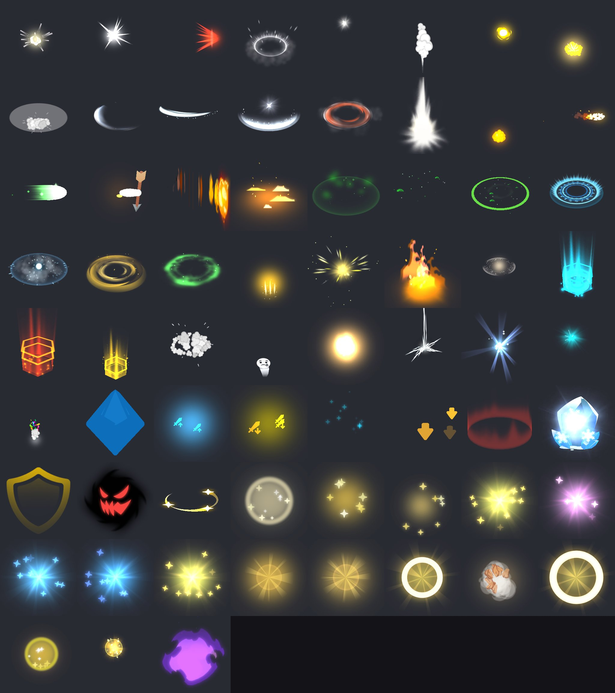

### World (51)

| Xem trước | Key | Nhóm | Cấp | Dùng cho | System · hạt · material · texture (cạnh) | Thời gian | Nguồn | Nợ so với trần 6.2 |
|---|---|---|---|---|---|---|---|---|
| 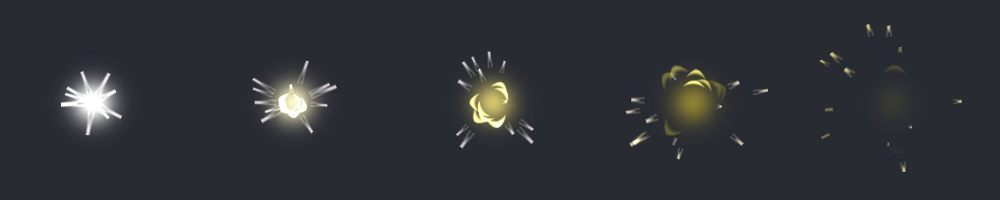 | `FX_Hit_Round_Yellow` | Hit | Basic | 2D, 3D | 3 · 21 · 2 · 2 (512) | 0,28 s | pack | 21 hạt (trần 20) |
| 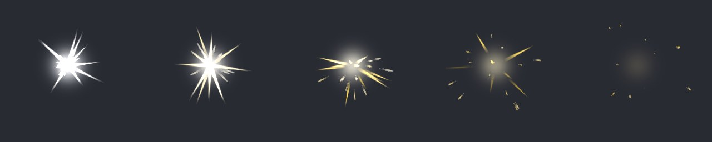 | `FX_Hit_Sword_Yellow` | Hit | Basic | 2D, 3D | 3 · 25 · 3 · 3 (512) | 0,31 s | pack | 25 hạt (trần 20); 3 material (trần 2); 3 texture (trần 2) |
| 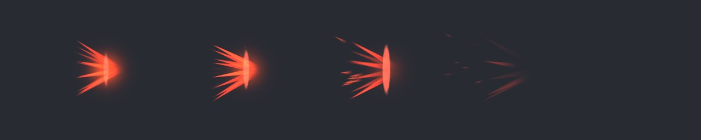 | `FX_Hit_Punch_Heavy` | Hit | Damage | 2D, 3D | 4 · 19 · 3 · 4 (512) | 0,36 s | pack | — |
| 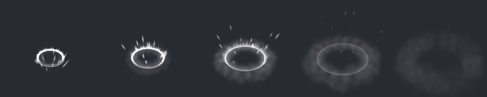 | `FX_Hit_Slam_Soft` | Hit | Damage | 3D | 4 · 29 · 4 · 4 (512) | 0,43 s | pack | 4 material (trần 3) |
| 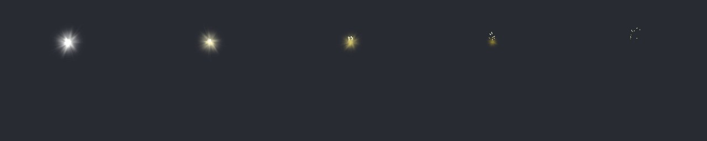 | `FX_Hit_Spark_Yellow` | Hit | Basic | 2D, 3D | 5 · 18 · 3 · 3 (512) | 0,17 s | pack | 5 system (trần 3); 3 material (trần 2); 3 texture (trần 2) |
| 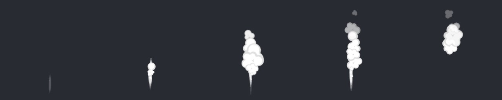 | `FX_Hit_Smoke_Burst` | Hit | Basic | 2D, 3D | 2 · 16 · 2 · 2 (512) | 1,47 s | pack | 1,47 s (trần 0,5 s) |
| 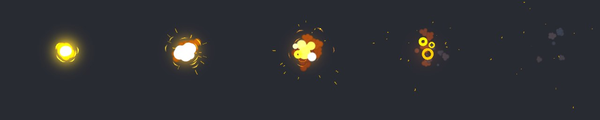 | `FX_Hit_Explosion_Fire` | Hit | Major | 2D, 3D | 5 · 47 · 5 · 6 (512) | 0,63 s | pack | 5 material (trần 4); 6 texture (trần 5) |
| 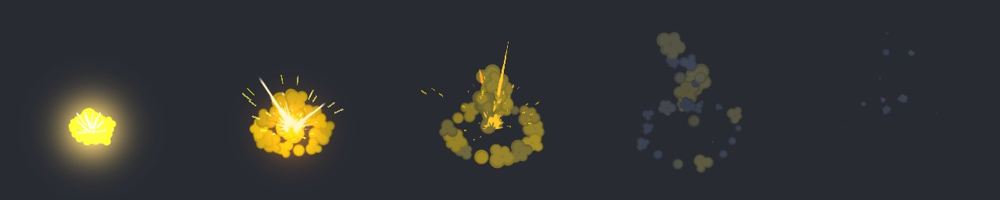 | `FX_Hit_Explosion_Grenade` | Hit | Major | 2D, 3D | 5 · 53 · 4 · 5 (683) | 0,69 s | pack | — |
| 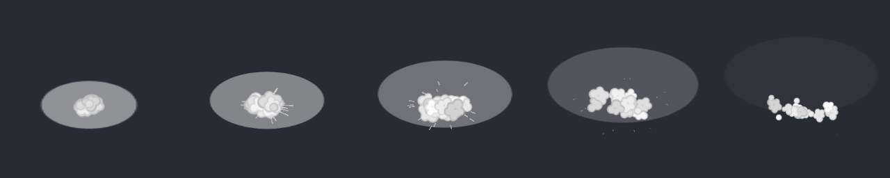 | `FX_Hit_Building` | Hit | Basic | 3D | 3 · 30 · 2 · 2 (512) | 0,55 s | team | 30 hạt (trần 20); 0,55 s (trần 0,5 s) |
|  | `FX_Slash_Thin_White` | Slash | Basic | 3D | 3 · 18 · 3 · 2 (512) | 0,28 s | pack | 3 material (trần 2) |
|  | `FX_Slash_Mini_Blue` | Slash | Basic | 3D | 2 · 16 · 2 · 3 (512) | 0,23 s | pack | 3 texture (trần 2) |
| 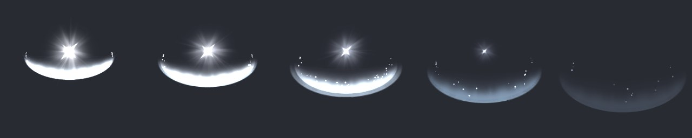 | `FX_Slash_Wave_White` | Slash | Damage | 3D | 5 · 40 · 4 · 4 (512) | 0,31 s | pack | 4 material (trần 3) |
| 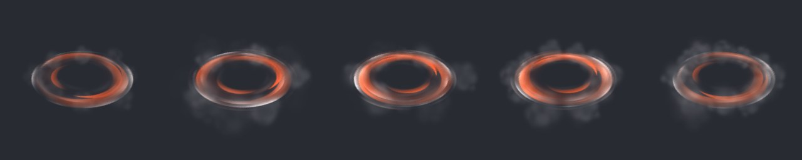 | `FX_Slash_Whirlwind_Red_Loop` | Slash | Damage | 3D | 3 · 15 · 3 · 3 (512) | lặp | pack | — |
| 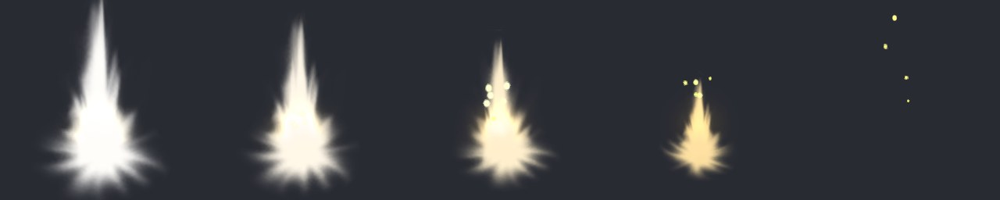 | `FX_Muzzle_Standard_Yellow` | Muzzle | Basic | 2D, 3D | 4 · 11 · 3 · 3 (512) | 0,24 s | pack | 4 system (trần 3); 3 material (trần 2); 3 texture (trần 2) |
| 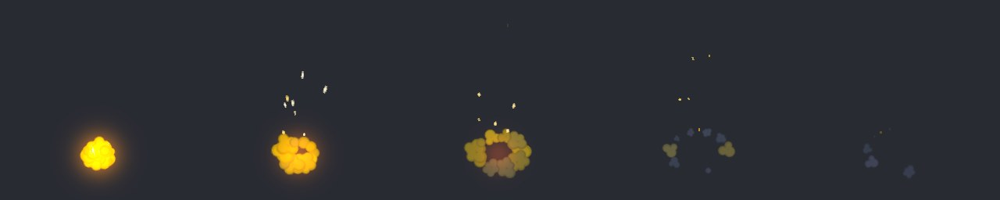 | `FX_Muzzle_Grenade_Fire` | Muzzle | Basic | 2D, 3D | 3 · 19 · 3 · 3 (512) | 0,62 s | pack | 3 material (trần 2); 3 texture (trần 2); 0,62 s (trần 0,5 s) |
| 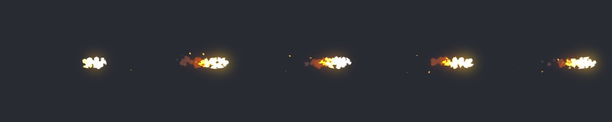 | `FX_Proj_Fireball_Loop` | Proj | Damage | 2D, 3D | 4 · 39 · 4 · 5 (512) | lặp | pack | 4 material (trần 3); 5 texture (trần 4) |
|  | `FX_Proj_Energy_Green_Loop` | Proj | Damage | 2D, 3D | 3 · 7 · 3 · 3 (512) | lặp | pack | — |
| 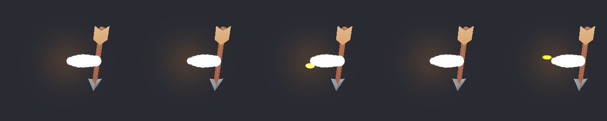 | `FX_Proj_Arrow_Loop` | Proj | Basic | 3D | 3 · 15 · 4 · 3 (512) | lặp | team | 4 material (trần 2); 3 texture (trần 2) |
| 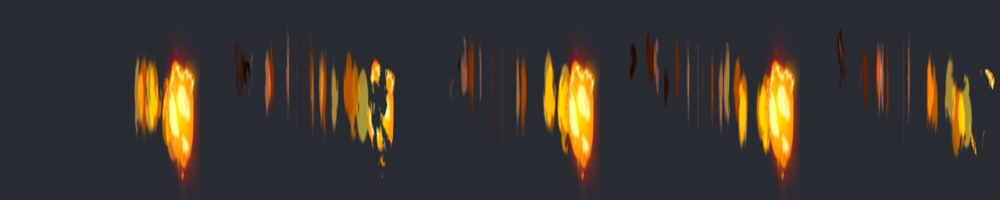 | `FX_Proj_Meteor_Loop` | Proj | Damage | 2D, 3D | 3 · 25 · 3 · 5 (1024) | lặp | team | 5 texture (trần 4) |
| 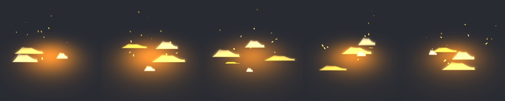 | `FX_AoE_Fire_Loop` | AoE | Damage | 2D, 3D | 3 · 24 · 3 · 4 (512) | lặp | pack | — |
| 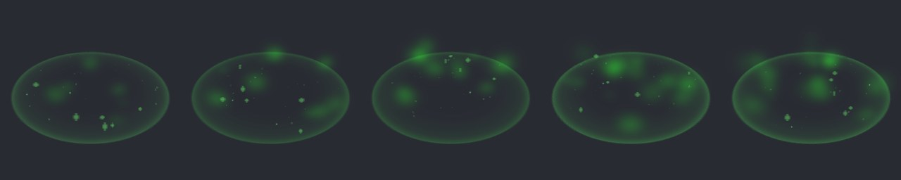 | `FX_AoE_Heal_Loop` | AoE | Support | 3D | 4 · 79 · 3 · 4 (512) | lặp | pack | 79 hạt (trần 30); 3 material (trần 2); 4 texture (trần 3) |
| 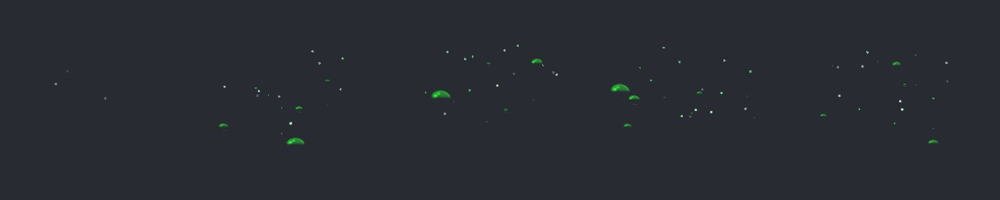 | `FX_AoE_Acid_Loop` | AoE | Damage | 2D, 3D | 3 · 37 · 2 · 2 (512) | lặp | pack | — |
| 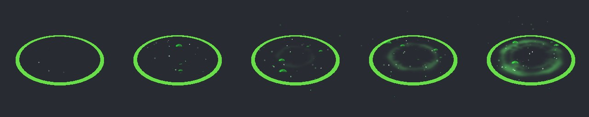 | `FX_AoE_Poison_Loop` | AoE | Damage | 3D | 5 · 78 · 5 · 4 (512) | lặp | team | 78 hạt (trần 60); 5 material (trần 3) |
| 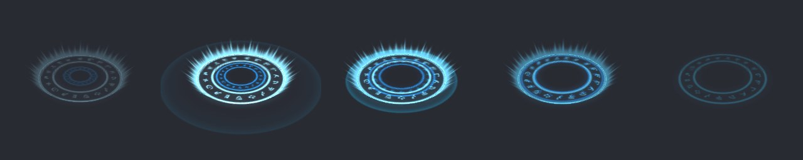 | `FX_AoE_MagicCircle_Blue` | AoE | Support | 3D | 4 · 4 · 3 · 3 (512) | 1,18 s | pack | 3 material (trần 2); 1,18 s (trần 0,5 s) |
| 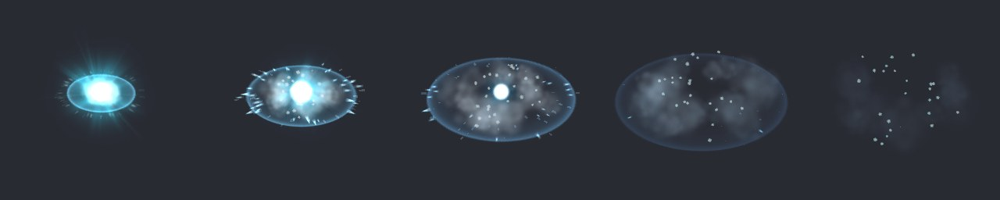 | `FX_AoE_Frost_Nova` | AoE | Major | 3D | 6 · 118 · 6 · 6 (512) | 0,65 s | pack | 118 hạt (trần 100); 6 material (trần 4); 6 texture (trần 5) |
| 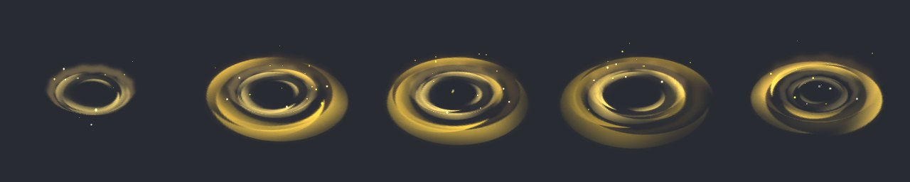 | `FX_Aura_Magic_Yellow_Loop` | Aura | Support | 3D | 3 · 29 · 3 · 3 (512) | lặp | pack | 3 material (trần 2) |
| 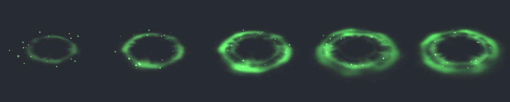 | `FX_Aura_Soft_Green_Loop` | Aura | Support | 3D | 2 · 41 · 2 · 2 (512) | lặp | pack | 41 hạt (trần 30) |
| 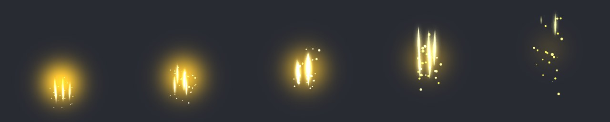 | `FX_Buff_Magic_Yellow` | Buff | Support | 2D, 3D | 3 · 31 · 3 · 3 (512) | 0,48 s | pack | 31 hạt (trần 30); 3 material (trần 2) |
| 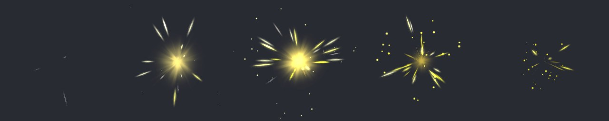 | `FX_Buff_Enchant_Yellow` | Buff | Support | 2D, 3D | 3 · 101 · 3 · 3 (512) | 0,53 s | pack | 101 hạt (trần 30); 3 material (trần 2); 0,53 s (trần 0,5 s) |
| 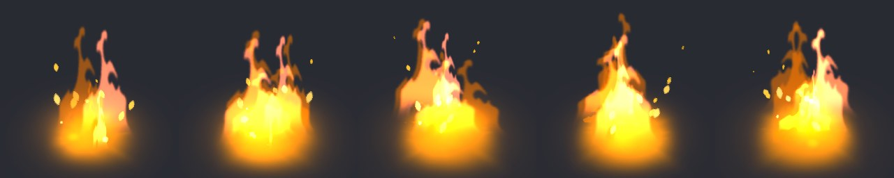 | `FX_Status_Burn_Loop` | Status | Support | 2D, 3D | 6 · 43 · 6 · 6 (1024) | lặp | team | 6 system (trần 4); 43 hạt (trần 30); 6 material (trần 2); 6 texture (trần 3) |
| 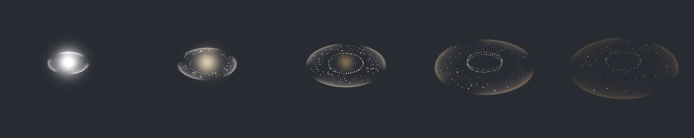 | `FX_Spawn_LevelUp_Yellow` | Spawn | Major | 3D | 4 · 341 · 3 · 3 (512) | 0,89 s | pack | 341 hạt (trần 100) |
| 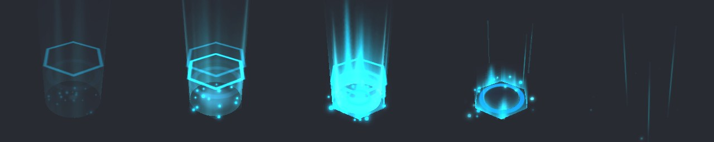 | `FX_Spawn_Summon_Ally` | Spawn | Major | 3D | 11 · 52 · 3 · 8 (512) | 0,8 s | team | 11 system (trần 6); 8 texture (trần 5) |
| 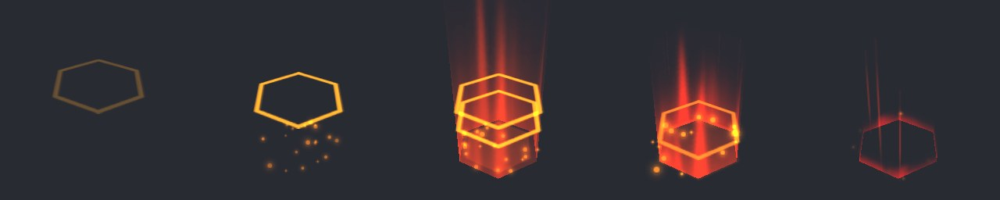 | `FX_Spawn_Summon_Enemy` | Spawn | Major | 3D | 5 · 30 · 2 · 6 (512) | 0,58 s | team | 6 texture (trần 5) |
| 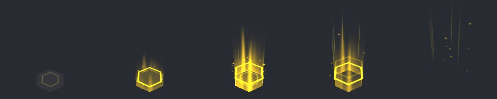 | `FX_Spawn_Upgrade` | Spawn | Damage | 3D | 5 · 30 · 2 · 6 (512) | 1,18 s | team | 6 texture (trần 4) |
| 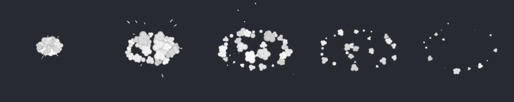 | `FX_Death_Soul` | Death | Basic | 2D, 3D | 3 · 47 · 2 · 2 (512) | 0,97 s | pack | 47 hạt (trần 20); 0,97 s (trần 0,5 s) |
|  | `FX_Death_Unit` | Death | Basic | 2D, 3D | 1 · 1 · 2 · 2 (512) | 0,89 s | team | 0,89 s (trần 0,5 s) |
| 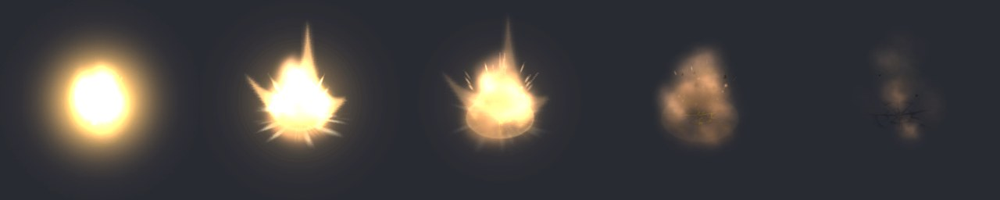 | `FX_Death_Building` | Death | Major | 3D | 13 · 172 · 3 · 7 (520) | 0,58 s | team | 13 system (trần 6); 172 hạt (trần 100); 7 texture (trần 5) |
| 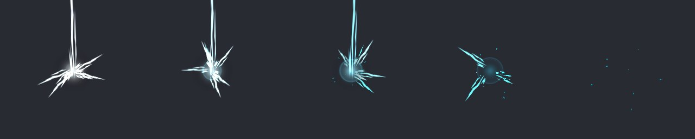 | `FX_Env_Lightning_Strike` | Env | Major | 2D, 3D | 5 · 17 · 4 · 4 (683) | 0,28 s | pack | — |
|  | `FX_Env_GlowOrb_Blue_Loop` | Env | Ambient | 2D, 3D | 3 · 43 · 3 · 3 (512) | lặp | pack | 3 system (trần 2); 43 hạt (trần 15); 3 material (trần 1); 3 texture (trần 1) |
| 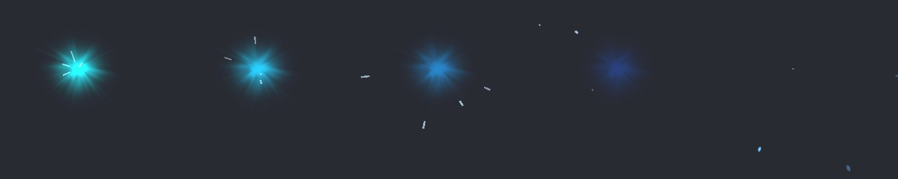 | `FX_Env_Firework_Blue` | Env | Major | 2D, 3D | 5 · 123 · 3 · 3 (512) | 0,46 s | pack | 123 hạt (trần 100) |
| 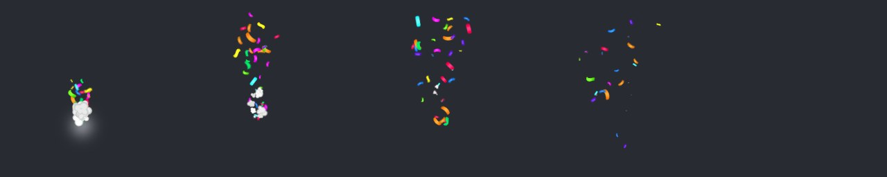 | `FX_Env_Confetti_Loop` | Env | Damage | 2D, 3D | 3 · 48 · 3 · 3 (512) | lặp | pack | — |
|  | `FX_Pickup_EnergyOrb_Loop` | Pickup | Ambient | 2D, 3D | 2 · 2 · 3 · 3 (512) | lặp | team | 3 material (trần 1); 3 texture (trần 1) |
|  | `FX_Buff_AttackUp_2D_Loop` | Buff | Support | 2D | 2 · 8 · 1 · 2 (512) | lặp | team | — |
|  | `FX_Debuff_AttackDown_2D_Loop` | Debuff | Support | 2D | 2 · 6 · 2 · 2 (512) | lặp | team | — |
| 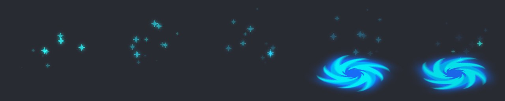 | `FX_Buff_Haste_2D_Loop` | Buff | Support | 2D | 2 · 18 · 2 · 2 (277) | lặp | team | — |
|  | `FX_Debuff_Slow_2D_Loop` | Debuff | Support | 2D | 1 · 5 · 1 · 1 (512) | lặp | team | — |
| 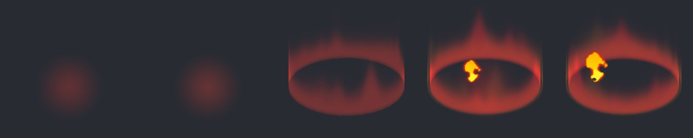 | `FX_Status_Burn_2D_Loop` | Status | Support | 2D | 4 · 5 · 3 · 5 (525) | lặp | team | 3 material (trần 2); 5 texture (trần 3) |
|  | `FX_Status_Freeze_2D_Loop` | Status | Support | 2D | 3 · 3 · 3 · 4 (1024) | lặp | team | 3 material (trần 2); 4 texture (trần 3) |
|  | `FX_Shield_Block_2D_Loop` | Shield | Support | 2D | 1 · 1 · 1 · 1 (256) | lặp | team | — |
|  | `FX_Status_Fear_2D_Loop` | Status | Support | 2D | 2 · 2 · 1 · 2 (277) | lặp | team | — |
|  | `FX_Status_Stun_2D_Loop` | Status | Support | 2D | 1 · 3 · 2 · 1 (128) | lặp | team | — |

### UI canvas (16)

| Xem trước | Key | Nhóm | Cấp | Dùng cho | System · hạt · material · texture (cạnh) | Thời gian | Nguồn | Nợ so với trần 6.2 |
|---|---|---|---|---|---|---|---|---|
|  | `FX_UI_Merge_Impact_01` | UI | UI lớn | Canvas | 4 · 14 · 2 · 3 (512) | 0,54 s | team | — |
|  | `FX_UI_Merge_Impact_02` | UI | UI lớn | Canvas | 2 · 9 · 1 · 2 (512) | 0,47 s | team | — |
|  | `FX_UI_Merge_Impact_03` | UI | UI lớn | Canvas | 2 · 9 · 2 · 2 (512) | 0,47 s | team | — |
|  | `FX_UI_Shine_Gold` | UI | UI nhỏ | Canvas | 4 · 15 · 3 · 4 (512) | 0,8 s | team | 4 system (trần 2); 3 material (trần 1); 4 texture (trần 1) |
|  | `FX_UI_Shine_Gem` | UI | UI nhỏ | Canvas | 4 · 15 · 3 · 4 (512) | 0,8 s | team | 4 system (trần 2); 3 material (trần 1); 4 texture (trần 1) |
|  | `FX_UI_Shine_Energy` | UI | UI nhỏ | Canvas | 4 · 15 · 3 · 4 (512) | 0,8 s | team | 4 system (trần 2); 3 material (trần 1); 4 texture (trần 1) |
|  | `FX_UI_Shine_Exp` | UI | UI nhỏ | Canvas | 4 · 15 · 3 · 4 (512) | 0,8 s | team | 4 system (trần 2); 3 material (trần 1); 4 texture (trần 1) |
|  | `FX_UI_Shine_Star` | UI | UI nhỏ | Canvas | 4 · 15 · 3 · 4 (512) | 0,8 s | team | 4 system (trần 2); 3 material (trần 1); 4 texture (trần 1) |
|  | `FX_UI_Complete_Burst_Loop` | UI | UI lớn | Canvas | 8 · 12 · 3 · 5 (512) | lặp | team | — |
|  | `FX_UI_Complete_Idle_Loop` | UI | UI nhỏ | Canvas | 7 · 16 · 3 · 3 (512) | lặp | team | 7 system (trần 2); 3 material (trần 1); 3 texture (trần 1) |
|  | `FX_UI_Done_Item` | UI | UI lớn | Canvas | 5 · 5 · 3 · 6 (545) | 0,38 s | team | — |
| 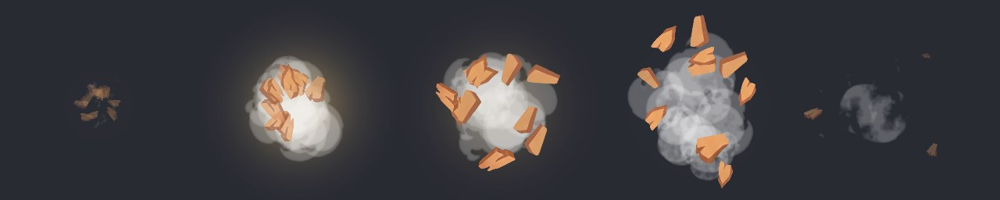 | `FX_UI_Break_Box` | UI | UI lớn | Canvas | 4 · 22 · 3 · 6 (545) | 0,58 s | team | — |
| 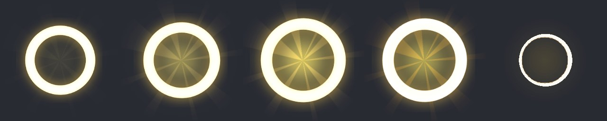 | `FX_UI_Use_Item` | UI | UI lớn | Canvas | 5 · 5 · 3 · 6 (545) | 0,35 s | team | — |
| 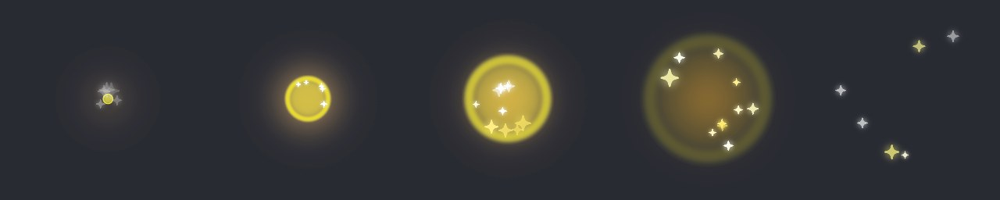 | `FX_UI_Boost_Impact` | UI | UI lớn | Canvas | 4 · 14 · 2 · 3 (512) | 0,62 s | team | — |
| 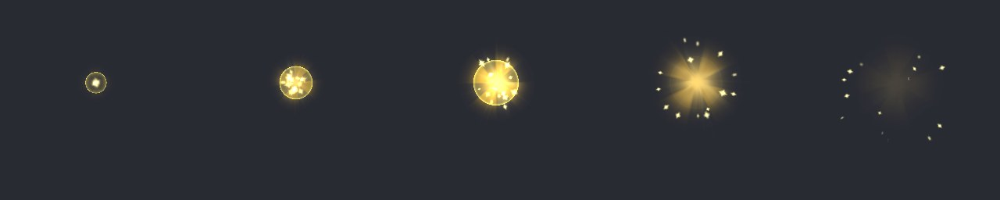 | `FX_UI_Unlock_Impact` | UI | UI lớn | Canvas | 4 · 19 · 1 · 4 (512) | 0,45 s | team | — |
| 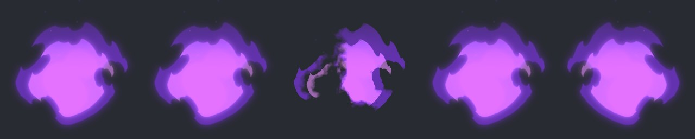 | `FX_UI_Fire_Loop` | UI | UI nhỏ | Canvas | 2 · 2 · 1 · 2 (256) | lặp | team | 2 texture (trần 1) |


## 4. Nợ và việc tiếp

- 43 / 67 hiệu ứng vượt ít nhất một trần của cấp (bảng trên), theo loại:
  material (28 hiệu ứng), texture (27 hiệu ứng), hạt (15 hiệu ứng), system (12 hiệu ứng), thời gian (7 hiệu ứng).
- Material vượt trần không phải vì khác màu (gộp theo tint không bớt được hiệu ứng nào): mỗi lớp một texture riêng. Trả nợ bằng
  atlas texture của từng hiệu ứng, một material cho cả hiệu ứng (quy chuẩn 6.7.1): việc của lượt sau, cùng lúc với trần texture.
- Chưa đánh dấu yếu tố phụ `_Sec` (quy chuẩn 2.2): tier Thấp chưa có gì để tắt. `FXEffect.LowQuality` mới tắt `_Sec`, chưa
  giảm hạt × 0,5 như 6.4. Tên con trong prefab còn theo game gốc, chưa
  theo quy chuẩn 8.4.
- Từ quy chuẩn 0.2.4 khuôn prefab là root → `containers` → lớp snake_case có kiểu trộn và đuôi `_sec` (7.1, 8.4); prefab, material
  đặt tên snake_case (8.2). Cả 67 hiệu ứng của thư viện còn theo khuôn cũ (key `FX_<Nhóm>_<Tên>`, con PascalCase, không có
  `containers`): đổi khi dựng lại thư viện. Đổi key là đổi tên đã vào code, dữ liệu của game đang dùng (quy chuẩn 8.1): giữ key
  cũ cho game đã dùng.
- `FXEffect.LowQuality` tìm đuôi `_Sec` (S hoa); khuôn mới dùng `_sec`. Sửa `FXEffect` để nhận đuôi `_sec`, không phân biệt hoa
  thường, trước khi dùng tier Thấp với hiệu ứng làm theo khuôn mới.
- Một số system đã bỏ vì hỏng sẵn ở game gốc: sprite không còn trong repo của game (hạt vẽ ô trắng), hoặc game gán sprite lúc
  chạy (icon của item đang merge, đang dùng). Các hiệu ứng UI merge, dùng item, hoàn thành không còn lớp hạt đó; game cần bay icon
  thì tự thêm system với sprite của mình.
- Tier đang gán theo tên và cách game gốc dùng; GD chốt lại khi đưa vào game (2.1).
- Shader chung là unlit, không soft particle, không distortion: hiệu ứng gốc dùng shader riêng đã thành hạt thường.
- Bản đổi khỏi frame-by-frame chỉ giữ một khung: hình vẽ tay đổi nhiều qua các khung mất nét (lửa 2D vẽ tay, lõi thiên thạch,
  lửa UI), cần vẽ lại cho shader (quy chuẩn 4.7.5). Vòng cuối của `FX_UI_Done_Item` mỏng dần nhưng không mờ đi như bản gốc. Mỗi hiệu ứng đã đổi thêm một texture dùng chung (noise hoặc hướng tâm),
  nên vài hiệu ứng vượt trần số texture. Các hiệu ứng đã đổi: `FX_Hit_Punch_Heavy`, `FX_Hit_Explosion_Fire`, `FX_Hit_Explosion_Grenade`, `FX_Slash_Mini_Blue`, `FX_Proj_Fireball_Loop`, `FX_Proj_Meteor_Loop`, `FX_AoE_Fire_Loop`, `FX_AoE_Heal_Loop`, `FX_Status_Burn_Loop`, `FX_Env_Lightning_Strike`, `FX_Status_Burn_2D_Loop`, `FX_Status_Freeze_2D_Loop`, `FX_UI_Done_Item`, `FX_UI_Break_Box`, `FX_UI_Use_Item`, `FX_UI_Fire_Loop`.
- Ảnh render ở Gamma (5 / 6 game của team). Project Linear (vd project module này): additive sáng hơn, dải màu khác; duyệt lại
  trên máy.
- Hiệu ứng UI không có phần `Image` trong ảnh xem trước (ảnh chỉ vẽ hạt).
- Chưa đo trên máy thật (quy chuẩn 12.3).

## 5. Thêm hiệu ứng vào thư viện

**[TA]** Tool ở tài liệu phát triển của repo module, không đi kèm module: `Docs/GameVFX/tools/library` (Node) và
`Docs/GameVFX/tools/library/unity/GameVFXLibraryBuild.cs` (Unity Editor). Lệnh đầy đủ: `Docs/GameVFX/GameVFX_KhaoSat.md` mục 12.

1. Chọn prefab đã ship trong game, tự đứng được (không cần script của game mới hiện), không gắn với nội dung riêng của game.
2. Thêm một dòng vào danh sách trong `make_plan.cjs` (key theo quy chuẩn 8.2, nhóm, world / ui, cấp, 2D / 3D, game, tên prefab),
   rồi chạy `make_plan.cjs` (tìm prefab trong kết quả quét của `vfx_scan.mjs`), `harvest.mjs` (chép prefab và mọi phụ thuộc với
   GUID mới), `material_info.mjs` (ghi shader gốc của từng material), `unity_manifest.cjs`. Harvest luôn chạy lại từ đầu cho cả
   thư viện: GUID sinh theo khoá nên ra đúng GUID cũ.
3. Trên một bản chép của project module (không chạy batch trên project đang mở), có UIParticle và Blender: chép
   `GameVFXLibraryBuild.cs` vào `Assets/_Project/Core/Modules/GameVFX/Editor/`, chạy `GameVFXLibraryBuild.SetGamma` rồi
   `GameVFXLibraryBuild.RunAll`. Kết quả: prefab đã chuẩn hoá, `report.json` (log từng bước bỏ gì, sửa gì), ảnh xem trước.
4. Chạy `check_refs.cjs` (mọi tham chiếu nằm trong thư viện, sprite có thật) và xem ảnh: hiệu ứng trống, sai màu, ô trắng thì bỏ
   hoặc sửa. Chép folder `Library` và ảnh vào `Docs/Previews~` của project module, sinh lại tài liệu này bằng `gen_catalog.cjs`,
   tăng phiên bản trong `CHANGELOG.md`.
